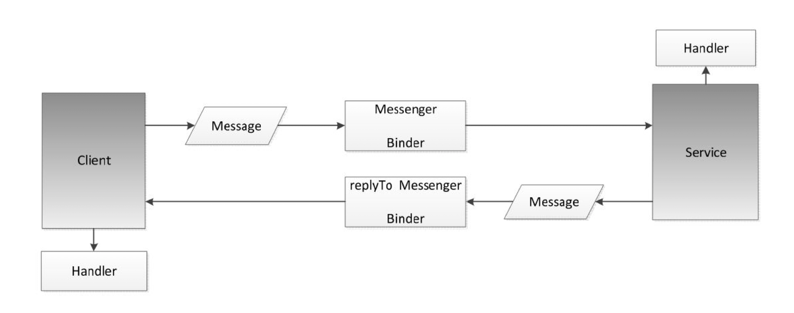

### Serializable接口和Parcelable接口

#### Serializable

Serializable是一个Java空接口，实现它可以实现序列化和反序列化。只需要在类中指定下面的表示即可实现：

```java
private static final long serialVersionUID = 8711368828010083044L
```

* 序列化时将serialVersionUID写入文件，当反序列化时系统会去检测类的serialVersionUID和文件中的serialVersionUID是否一致，一致则成功反序列化，否则无法正常序列化。
* serialVersionUID是可以修改的，也可以用文件的hash值。手动指定时，当我们为一个类增加了一些成员变量，依然可以序列化成功，否则会报错。但若是删除了变量，或者修改了变量的类型，虽然serialVersionUID一致，类的结构发生了变化，依然会反序列化失败。
* transient关键字标记的成员变量不参与序列化。

<!--more-->

#### Parcelable

Parcelable是Android提供的序列化接口，AS目前可以一键生成(666)。可以通过Intent和Binder进行传递。注意：Parcelable中的变量书序要严格和writeToParcel()中的顺序一致！

#### 区别

* Serializable开销大，序列化和反序列化需要大量的I/O操作。
* Parcelable用在内存序列化上，使用较复杂。
* 若要序列化到文件或序列化后通过网络传输，推荐Serializable，简单。Parcelable不是不可以，但较复杂，而且Parcelable依赖数据流的写入顺序(此处等待查资料)。

### Android多进程模式

开启多进程会造成以下问题：

* **Application多次创建**
* **静态成员和单例模式完全失效**
* **线程同步机制完全失效**
* **SharedPreferences可靠性下降**

### 解决方法

#### Application多次创建多次创建问题

大多数情况下，我们会在Application中初始化一些第三方SDK或做一些全局性的初始化操作，如果不对进程做区分的话，会初始化多次。主进程默认以包名为进程名，其他的也是我们自定义的，因此在onCreate中判断进程名，执行相应的初始化操作即可：

```kotlin
override fun onCreate() {
        super.onCreate()
        appContext=applicationContext
        me=this
        val processName = getProcessName(Process.myPid())
        val packageName = packageName
        if (packageName == processName) {
            // init something
        }
    }

    /**
     * 根据进程 ID 获取进程名
     * @param pid
     * @return
     */
    fun getProcessName(pid: Int): String? {
        val am = MyApp.appContext.getSystemService(Context.ACTIVITY_SERVICE) as ActivityManager
        val processInfoList = am.runningAppProcesses ?: return null
        for (processInfo in processInfoList) {
            if (processInfo.pid == pid) {
                return processInfo.processName
            }
        }
        return null
    }

    /**
     * 黑科技
     * @return
     */
    fun getProcessName(): String? {
        try {
            val file = File("/proc/" + Process.myPid() + "/" + "cmdline")
            val mBufferedReader = BufferedReader(FileReader(file))
            val processName = mBufferedReader.readLine().trim { it <= ' ' }
            mBufferedReader.close()
            return processName
        } catch (e: Exception) {
            e.printStackTrace()
            return null
        }
    }
```

### Android中IPC方式

Android中有以下几种方式实现进程间通信：

* 使用Bundle
* 使用文件共享
* 使用Messenger
* 使用AIDL
* 使用ContentProvider
* 使用Socket

Bundle可以通过Intent等传递给另一个进程的Activity和Service等。

文件共享存在并发读写问题。

Messenger底层基于AIDL实现，要实现多进程间Server和Client双向通信，Server需要创建ServerHandler和ServerMessenger，Client也需要创建ClientHandler和ClientMessenger。ServerMessenger通过Service的onBind方法返回给Client，Client发送Message给Server时通过Message的replyTo传递给Server，Server就可以跟Client通信啦。Messenger为串行通信，不需要考虑并发读写问题。

一张Messenger图(摘自Android开发艺术探索):




### AIDL

AIDL支持的数据类型：

- 基本数据类型(int、long、char、boolean、double等)
- 只支持ArrayList，里面每个元素都必须能够被AIDL支持
- 只支持HashMap，里面的每个元素都必须被AIDL支持，包括key和value
- Parcelable：所有实现了Parcelable接口的对象
- AIDL：所有的AIDL接口本身也可以在AIDL文件中使用

#### AIDL创建

实现一个书籍管理系统，仅仅包含书籍添加和查询俩远程方法。

**注意**：AS下AIDL引用java类可能报找不到类的错误，需要在app module下的build.gradle中加入sourceSets：

```groovy
android {
    sourceSets {
        main {
            manifest.srcFile 'src/main/AndroidManifest.xml'
            java.srcDirs = ['src/main/java', 'src/main/aidl']
            resources.srcDirs = ['src/main/java', 'src/main/aidl']
            aidl.srcDirs = ['src/main/aidl']
            res.srcDirs = ['src/main/res']
            assets.srcDirs = ['src/main/assets']
        }
    }
}
```

##### Server端

Server端需要一个service监听Client端的链接请求，处理Client端的数据请求，返回给Client端。AS目前支持一键生成AIDL。

###### Book.java

Book.java，实现了Parcelable接口。

```java
public class Book implements Parcelable {
    public int bookId;
    public String bookName;

    public Book(int bookId, String bookName) {
        this.bookId = bookId;
        this.bookName = bookName;
    }
    ....
}
```

###### Book.aidl

```java
// Book.aidl
package com.xcx.myandroiddemo;

parcelable Book;
```

Book.aidl是Book类的AIDL声明。

###### IBookManager.aidl

```java
// IBookManager.aidl
package com.xcx.myandroiddemo;

import com.xcx.myandroiddemo.Book;

interface IBookManager {
    List<Book> getBookList();
    void addBook(in Book book);
}
```

表明一个Server可以提供哪些能力，本例中获取书籍列表，添加书籍。

###### 远程服务端Service的实现

定义了AIDL文件，Server需要实现相应的接口，来表示可以提供哪些能力。创建BookManagerService继承Service：

```kotlin
class BookManagerService : Service() {

    val list=CopyOnWriteArrayList<Book>()

    override fun onBind(intent: Intent): IBinder {
        return binder
    }
    private val binder=object:IBookManager.Stub(){
        override fun getBookList(): MutableList<Book> {
            return list
        }

        override fun addBook(book: Book?) {
            list.add(book)
        }
    }
}
```

最后Service开启多进程：

```xml
<service
        android:process=":remote"
        android:name=".service.BookManagerService"
        android:enabled="true"
        android:exported="true">
</service>
```

#### Client端

客户端就比较简单了，绑定服务，获取Server端返回的Binder转换为AIDL接口，就可以调用Server端的方法了。

```kotlin
class MainActivity : AppCompatActivity() {

    var bookManager:IBookManager?=null

    override fun onCreate(savedInstanceState: Bundle?) {
        super.onCreate(savedInstanceState)
        setContentView(R.layout.activity_main)
        initListener()
    }

    private fun initListener() {
        bt1.setOnClickListener {
            bindService(Intent(this,BookManagerService::class.java),conn, Service.BIND_AUTO_CREATE)
        }
        bt2.setOnClickListener {
            bookManager?.apply {
                bookList.forEach {
                    Log.d("xcx",it.toString())
                }
            }
        }
        bt3.setOnClickListener {
            bookManager?.apply {
                val id=Random().nextInt(10000)
                addBook(Book(id,"Android $id"))
            }
        }

    }

    private val conn=object : ServiceConnection {
        override fun onServiceDisconnected(name: ComponentName?) {
        }

        override fun onServiceConnected(name: ComponentName?, service: IBinder?) {
            Log.d("xcx","bind success")
            bookManager=IBookManager.Stub.asInterface(service)
        }

    }
}
```

**调用AIDL远程方法会将当前线程挂起直到服务端返回数据，因此，远程方法若是耗时方法，需要注意不要在UI线程调用，会ANR。Server的binder运行在binder线程池内，Client需要做好同步，因为Server已经运行在另一个线程了。反过来，Server端调用Client端方法也是这样。**

#### Server意外死亡

Binder提供了两个方法**linkToDeath**和**unlinkToDeath**，通过**linkToDeath**给Binder设置死亡代理，当Server意外挂掉后，我们会收到通知，重启Server就可以了。

首先，声明一个DeathRecipient对象，DeathRecipient是一个接口，当Binder死亡时，会回调DeathRecipient的binderDied方法，此时就可以移除之前的绑定并重新绑定服务：

```kotlin
private val deathRecipient = object : IBinder.DeathRecipient {
    override fun binderDied() {
        bookManager?.asBinder()?.unlinkToDeath(this, 0)
        //重新绑定服务
    }
}
```

在绑定Service成功后，给binder设置死亡代理：

```kotlin
override fun onServiceConnected(name: ComponentName?, service: IBinder?) {
    Log.d("xcx", "bind success")
    bookManager = IBookManager.Stub.asInterface(service)
    service?.linkToDeath(deathRecipient, 0)
}
```

