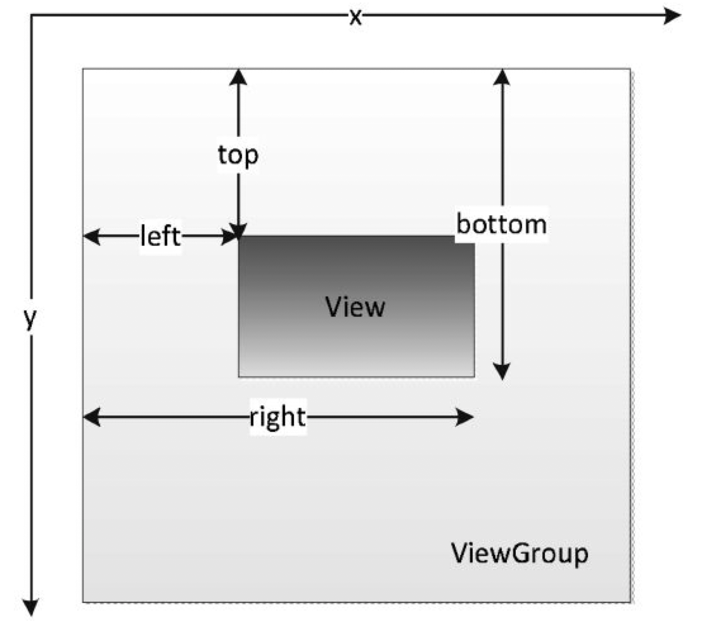

## <center>View事件体系</center>

<!--more-->

### View示意图



根据上图，我们可以计算View的宽高：

* width = right - left
* height = bottom - top

### TouchSlop

滑动的最小距离，当小于这个值时，系统不认为是在滑动，可以优化体验。这个值跟设备有关，不同设备的值可能不同。获取方法：

```kotlin
ViewConfiguration.get(this).scaledTouchSlop
```